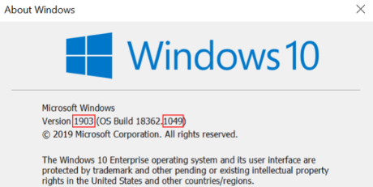
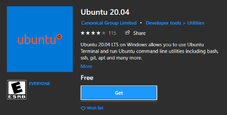
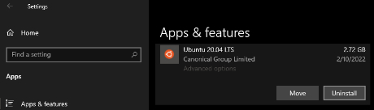
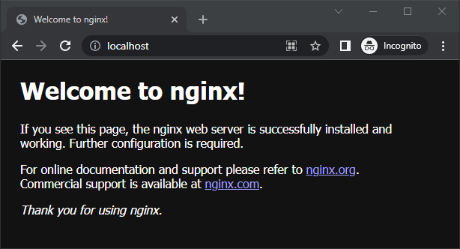
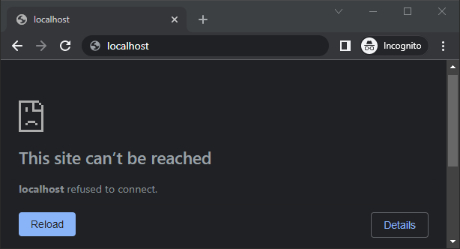
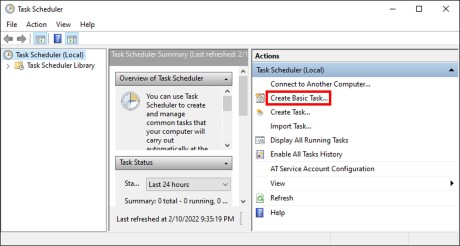
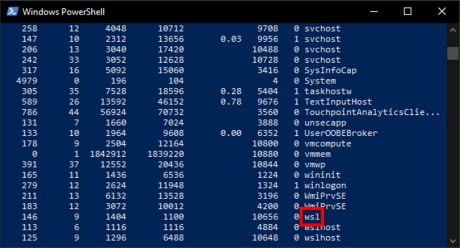

# [atet](https://github.com/atet) / [**_wsl_**](https://github.com/atet/wsl/blob/main/README.md#atet--wsl)

[](#nolink)

# Windows Subsystem for Linux

Let's bring the full power of Linux to your Windows computer!

We will cover everything that's needed to:
- Install Docker on WSL _without the need of Docker Desktop_
- Allow the WSL session (and Docker) to run in the background
- Start WSL (and Docker) automatically after reboot

--------------------------------------------------------------------------------------------------

## Table of Contents

### Introduction

* [0. Preface](#0-preface)
* [1. Requirements](#1-requirements)
* [2. WSL1 vs. WSL2](#2-wsl1-vs-wsl2)
* [3. CLI Docker](#3-cli-docker)
* [4. Special WSL Configuration](#4-special-wsl-configuration)

### Supplemental

* [Other Resources](#other-resources)
* [Troubleshooting](#troubleshooting)
* [Acknowledgments](#acknowledgments)

--------------------------------------------------------------------------------------------------

## 0. Preface

Windows Subsystem for Linux is literally the best thing from Microsoft since [Clippy](https://www.cnn.com/2021/07/15/tech/microsoft-clippy-emoji/index.html); for a quick summary see: https://www.youtube.com/watch?v=UMQ5GQix0rs

When WSL is combined with Docker that runs locally in the background, you now have the ease of Windows productivity applications alongside a Linux-based development environment

[Back to Top](#table-of-contents)

--------------------------------------------------------------------------------------------------

## 1. Requirements

#### Windows 10

* Windows Subsystem for Linux (WSL) is a fully supported Microsoft product for Windows 10: https://en.wikipedia.org/wiki/Windows_Subsystem_for_Linux
* Only WSL2 supports Docker, WSL1 does not
* **WSL2 requires a Windows 10 build version ≥1903 and minor build number ≥1049**

[](#nolink)

### Command Line Interface (CLI)

* You probably wouldn't be here if you don't really use CLI, but if you need a refresher: https://github.com/atet/learn/tree/master/regex

[Back to Top](#table-of-contents)

--------------------------------------------------------------------------------------------------

## 2. WSL1 vs. WSL2

> NOTE: If you already have WSL1 installed and you're upgrading to WSL2, you will lose everything (e.g. SSH keys, AWS configs, Git credentials, etc.) if you do not copy them over to your Windows partition

* If you know you don't have WSL1 or 2 installed, you will have to [install from scratch](#installing-wsl2-from-scratch)
* If you run the following command in PowerShell (as Administrator) and get something other than a "`2`", you will need to [upgrade from WSL1 to WSL2](#upgrading-wsl1-to-wsl2)

```powershell
> wsl --list --verbose
  NAME            STATE           VERSION
* Ubuntu-20.04    Running         2
```

* Otherwise, if you have WSL2 but haven't installed Docker (without Docker Desktop), [skip ahead to here](#3-cli-docker)

### Installing WSL2 from Scratch

* Open PowerShell as Administrator
* Install WSL with this command: 

```powershell
> dism.exe /online /enable-feature /featurename:Microsoft-Windows-Subsystem-Linux /all /norestart
```

* Enable the Virtual Machine Platform optional feature:

```powershell
> dism.exe /online /enable-feature /featurename:VirtualMachinePlatform /all /norestart
```

* **Restart your computer**
* Download the latest Linux kernel update package and install it: [WSL2 Linux kernel update package for x64 machines](https://docs.microsoft.com/en-us/windows/wsl/install-manual#step-4---download-the-linux-kernel-update-package)
* Open PowerShell as Administrator and set WSL version 2 as your default version:

```powershell
> wsl --set-default-version 2
For information on key differences with WSL 2 please visit https://aka.ms/wsl2
The operation completed successfully.
```

* You can now get a WSL2 Linux distribution from the Microsoft Store:
   * [Not all distributions can run under WSL2, Ubuntu 20.04 LTS is fully capable](#wsl2-capable-linux-distributions)

[](#nolink)

### Upgrading WSL1 to WSL2

* Back up everything you need to into your Windows partition (SSH keys, etc.)
* Uninstall your current WSL Linux distribution:

[](#nolink)

* Now [install WSL2 from scratch](#installing-wsl2-from-scratch)

[Back to Top](#table-of-contents)

--------------------------------------------------------------------------------------------------

## 3. CLI Docker

We will install CLI Docker by itself without the need for Docker Desktop

### Install and Test Installation

* Update, upgrade, and install Docker:

```bash
$ sudo apt update && sudo apt -y upgrade && sudo apt -y install docker.io
```

* Add you username to the `docker` group and exit and log back in for it to take effect:

```bash
$ sudo usermod -aG docker $USER && exit
```

* Test Docker to make sure the "`hello-world`" image downloads and container execution is successful:

```bash
$ docker run --name hello-world hello-world
.
.
.
Hello from Docker!
This message shows that your installation appears to be working correctly.
.
.
.
```

### Configure Docker to Start on WSL Startup

* Add the following lines at the bottom of the file to allow `sudo docker` commands to run in the background and save:
   * Replace "`<USERNAME>`" with you actual username in the file

```bash
$ sudo visudo
.
.
.
<USERNAME> ALL=(ALL) NOPASSWD: /usr/bin/dockerd
```

* Add the following lines at the bottom of the file to start Docker when WSL starts

```bash
$ nano ~/.bashrc
.
.
.
RUNNING=`ps aux | grep dockerd | grep -v grep`
if [ -z "$RUNNING" ]; then
    sudo dockerd > /dev/null 2>&1 &
    disown
fi
```

### Test to Confirm WSL and Docker Does Not Run in Background

* Download the following vanilla NGINX webserver and navigate to the webpage locally:
   * This commad will download the Docker image and run a container with it

```bash
$ docker run -it --rm -d -p 80:80 --name nginx_container nginx
```

* Navigate to "`localhost`" on your browser and you should see the NGINX splash page:

[](#nolink)

* Now close your WSL console window and this will cause the WSL session to terminate (along with Docker)
* After a few seconds, refresh the webpage and you will see that it cannot display since the NGINX webserver container is offline:

[](#nolink)

* Start back up a new WSL window, and restart the NGINX container:

```bash
$ docker restart nginx_container
```

* After a few seconds, refresh the webpage and you will see that the splash page displays again:

[](#nolink)

**This confirms that WSL and Docker are not running in the background when you close the WSL console and end the WSL session**, we will enable running WSL (and Docker) in the background next

[Back to Top](#table-of-contents)

--------------------------------------------------------------------------------------------------

## 4. Special WSL Configuration

* Start Powershell (as Administrator) and create a `vbs` script and open it in notepad:

```powershell
> echo "" > $HOME\run_wsl2_at_startup.vbs
> notepad $HOME\run_wsl2_at_startup.vbs
```

* Paste the following in the script for Ubuntu 20.04:

```powershell
> set object = createobject("wscript.shell")
> object.run "wsl.exe --distribution Ubuntu-20.04",0
```

* Open Task Scheduler and Create Basic Task
   * Name the task "WSL2" with description "Windows Subsystem for Linux 2", click Next
   * Select "When the computer starts", click Next
   * Select "Start a Program", click Next

[](#nolink)

* Specify Action
   * Copy and paste path into "Program/Script" field, "`%USERPROFILE%\run_wsl2_at_startup.vbs`", click Next
   * Check "Open the properties dialog for this task when I click Finish", click Finish
* General Tab
   * Select "Run Whether User Is Logged On or Not"
   * Select "Run With Highest Privileges"
* Specify Trigger
   * Click "Triggers" in the top bar → highlight "At Startup" → Click Edit
   * Check "Delay Task For" and enter "30 Seconds", click OK
* Settings Tab
   * Unselect "Stop the Task if It Runs Longer Than", click OK
* **Restart computer**
* Without starting the WSL console after reboot, confirm that WSL is running (as "`wsl`") in PowerShell by executing:

```powershell
> get-process
```

[](#nolink)

### Test to Confirm WSL and Docker Does Are Running in Background

* Ensure that the NGINX container from the previous step is running, in WSL console execute:

```bash
$ docker restart nginx_container
```

* Navigate to "`localhost`" on your browser and you should see the NGINX splash page:

[](#nolink)

* Now close your WSL console window; previously this would cause the WSL session to terminate (along with Docker)
* After a few seconds, refresh the webpage and you will see that it is still displaying:

[](#nolink)

### **Congratulations, this confirms that the WSL session and Docker are still running in the background even when you close the WSL console**

[Back to Top](#table-of-contents)

--------------------------------------------------------------------------------------------------

## Other Resources

Description | Link
--- | ---
Other reasons to use WSL2 over WSL1 | https://docs.microsoft.com/en-us/windows/wsl/compare-versions

### WSL2-Capable Linux Distributions

* Alpine WSL
* Debian GNU/Linux
* Fedora Remix for WSL
* Kali Linux
* openSUSE Leap 15.1
* Pengwin
* Pengwin Enterprise
* SUSE Linux Enterprise Server 12 SP5
* SUSE Linux Enterprise Server 15 SP1
* Ubuntu
* Ubuntu 16.04 LTS
* Ubuntu 18.04 LTS
* Ubuntu 20.04 LTS

[Back to Top](#table-of-contents)

--------------------------------------------------------------------------------------------------

## Troubleshooting

Issue | Solution
--- | ---
**"It's not working!"** | This concise tutorial has distilled hours of sweat, tears, and troubleshooting; _it can't not work_

[Back to Top](#table-of-contents)

--------------------------------------------------------------------------------------------------

## Acknowledgments

* Docker instructions adapted from: https://medium.com/geekculture/run-docker-in-windows-10-11-wsl-without-docker-desktop-a2a7eb90556d
* Special WSL configurations adapted from: https://medium.com/swlh/how-to-run-ubuntu-in-wsl2-at-startup-on-windows-10-c4567d6c48f1

[Back to Top](#table-of-contents)

--------------------------------------------------------------------------------------------------

<p align="center">Copyright © 2022-∞ Athit Kao, <a href="http://www.athitkao.com/tos.html" target="_blank">Terms and Conditions</a></p>