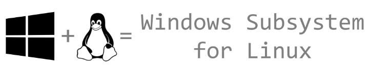

# [atet](https://github.com/atet) / [**_wsl_**](https://github.com/atet/wsl/blob/main/README.md#atet--wsl)

# Windows Subsystem for Linux

These are instructions will bring the power of Linux to your Windows 10 computer!

We will cover everything that's needed to:
- Install Docker on WSL without the need of Docker Desktop
- Allow the WSL session (and Docker) to run in the background
- Start WSL (and Docker) after boot

--------------------------------------------------------------------------------------------------

## Table of Contents

### Introduction

* [0. Preface](#0-preface)
* [1. Requirements](#1-requirements)
* [2. WSL1 vs. WSL2](#2-wsl1-vs-wsl2)
* [3. Docker](#3-docker)
* [4. Special WSL Configuration](#4-special-wsl-configuration)
* [5. Testing](#5-testing)

### Supplemental

* [Other Resources](#other-resources)
* [Troubleshooting](#troubleshooting)
* [Acknowledgments](#acknowledgments)

--------------------------------------------------------------------------------------------------

## 0. Preface

* Windows Subsystem for Linux is literally the best thing from Microsoft since Paint 3D and Edge: https://www.youtube.com/watch?v=UMQ5GQix0rs
* Combined with a Linux CLI Docker that runs locally in the background, you now have the ease of Windows productivity applications alongside your development environment

[Back to Top](#table-of-contents)

--------------------------------------------------------------------------------------------------

## 1. Requirements

#### Windows 10

* Windows Subsystem for Linux (WSL) is a fully supported Microsoft product for Windows 10: https://en.wikipedia.org/wiki/Windows_Subsystem_for_Linux
* WSL is only available for Windows 10

### Command Line Interface (CLI)

You probably wouldn't be here if you didn't use CLI, but if you need a refresher: https://github.com/atet/learn/tree/master/regex

[Back to Top](#table-of-contents)

--------------------------------------------------------------------------------------------------

## 2. WSL1 vs. WSL2

[Back to Top](#table-of-contents)

--------------------------------------------------------------------------------------------------

## 3. Docker

[Back to Top](#table-of-contents)

--------------------------------------------------------------------------------------------------

## 4. Special WSL Configuration

[Back to Top](#table-of-contents)

--------------------------------------------------------------------------------------------------

## 5. Testing

[Back to Top](#table-of-contents)

--------------------------------------------------------------------------------------------------

## Other Resources

### External Tutorials

Description | Link
--- | ---
**"MOAR MORGBOB!!!"** | https://www.morgbob.com

[Back to Top](#table-of-contents)

--------------------------------------------------------------------------------------------------

## Troubleshooting

Issue | Solution
--- | ---
**"It's not working!"** | This concise tutorial has distilled hours of sweat, tears, and troubleshooting; _it can't not work_

[Back to Top](#table-of-contents)

--------------------------------------------------------------------------------------------------

## Acknowledgments

* List resources here

[Back to Top](#table-of-contents)

--------------------------------------------------------------------------------------------------

Copyright © 2022-∞ Athit Kao, <a href="http://www.athitkao.com/tos.html" target="_blank">Terms and Conditions</a>
